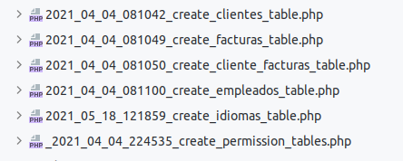

<p align="center"><a href="https://laravel.com" target="_blank"></a></p>

<p align="center">
<a href="https://travis-ci.org/laravel/framework"></a>
<a href="https://packagist.org/packages/laravel/framework"></a>
<a href="https://packagist.org/packages/laravel/framework"></a>
<a href="https://packagist.org/packages/laravel/framework"></a>
</p>

## About Laravel

Laravel is a web application framework with expressive, elegant syntax. We believe development must be an enjoyable and creative experience to be truly fulfilling. Laravel takes the pain out of development by easing common tasks used in many web projects, such as:

- [Simple, fast routing engine](https://laravel.com/docs/routing).
- [Powerful dependency injection container](https://laravel.com/docs/container).
- Multiple back-ends for [session](https://laravel.com/docs/session) and [cache](https://laravel.com/docs/cache) storage.
- Expressive, intuitive [database ORM](https://laravel.com/docs/eloquent).
- Database agnostic [schema migrations](https://laravel.com/docs/migrations).
- [Robust background job processing](https://laravel.com/docs/queues).
- [Real-time event broadcasting](https://laravel.com/docs/broadcasting).

Laravel is accessible, powerful, and provides tools required for large, robust applications.

## Gestor de una empresa básica
*Instalamos la aplicación
``````shell
laravel new empresa_roles
``````

*App para usar de ejemplo para gestionar roles

*Instalamos la autenticación con breeze (esto me instala tailwind)
``````shell
composer require  'laravel/breeze'
php artisan breeze:install
(para la parte de cliente, tailwindcss )
npm install  
``````

## Instalamos la autentificación con breeze
   ``````shell
   php artisan breeze:install
   npm install
   ``````


1. Creamos los modelos con --all (modelo, controlador, migracion, seeder, factory)
   ``````shell
   php artisan make:model Cliente -a
   php artisan make:model Factura -a
   php artisan make:model Empleado -a
   php artisan make:model Idioma -a
   php artisan make:model cliente_factura -a 
   ``````
2. Rellenamos las migraciones
   Para ello escribimos los ficheros ubicados en ****database/migrations****
   Concretamente se rellenan los ficheros.
   Observar la forma de establecer el foreign key en las tablas
      .
3. Establecemos los seeders para poblar la bd
    Primero establecemos el idioma en castellano, estableciendo en
   ****config/app.php**** el parámetro correspondiente
   ``````bash
      'faker_locale' => 'es_ES',
   `````
4.- Ejecutamos las migraciones para crear la base de datos y poblarla. Previamente nos aseguramos que existe la base de datos que tengamos especificada en el fichero de configuración ***(ver .ENV )***
   ``````bash
      php artisan migrate:install
      php artisan migrate --seed
   ``````
   En case de tener que volver a ejectuarlas, no olvides el parámetro *****fresh*****
   ``````bash
      php artisan migrate:fresh --seed
   ``````
   

## Navegación
.

## Instalamos página general 
1. Usamos componentes si no hay funcionalidad
2. Usamos vue si el componente tiene funcionalidad


